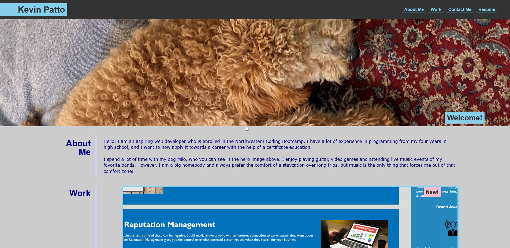

# My Portfolio

## Description

This project was made to show employers an easy way to access all the projects I have worked on. With this website, an effective portfolio can be seen by employers to easily look through websites, and it serves as part of my portfolio as well. I learned a lot about CSS styling and how to turn a wireframe/reference image into a stylized webpage.

## Installation

N/A

## Usage

Use website to navigate to various projects I have worked on.

[Link to GitHub Pages website](https://kevinpatto.github.io/My-Portfolio-Webpage/)

## Credits

Thank you to my dog, Milo, for being my cover photo.

## License

MIT Liscense